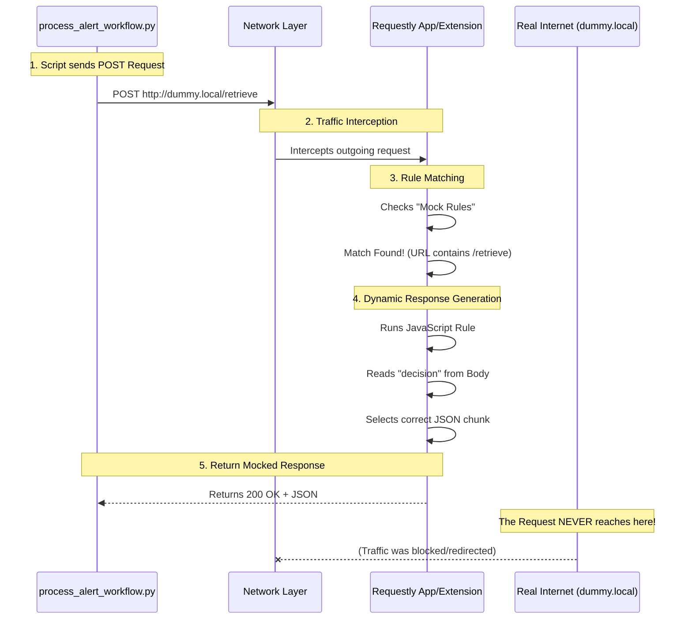

# How Requestly Works in This Architecture

Requestly acts as a **MITM (Man-in-the-Middle) Interceptor** and **Rule Engine** that sits between your code (the Client) and the Internet.

In our Maintenance Agent workflow, we are using it to **fake** a backend server that doesn't actually exist yet.

## The Workflow Visualization

## Key Concepts

### 1. Interception
Requestly hooks into the network stack (via Browser Extension or Desktop App VPN/Proxy). When your Python script tries to connect to `http://dummy.local`, Requestly sees this attempt **before** it leaves your computer.

### 2. DNS/Host Resolution
Normally, `dummy.local` would result in a "Could not resolve host" error (like I saw in my environment).
*   **With Requestly**: It recognizes the domain or URL pattern and says "I know this!" and takes over.

### 3. Rules Engine
We configured a **"Modify Response"** rule.
*   **Trigger**: `URL` contains `/retrieve` AND `Method` is `POST`.
*   **Action**: "Don't send this to the real internet. Instead, run this JavaScript code and send the *result* back to the client immediately."

### 4. The "Agentic" Benefit
This allows us to build the **Maintenance Agent** (Client) completely independently of the **Knowledge Base API** (Server).
*   We defined the *contract* (JSON input/output).
*   We *mocked* the server with Requestly.
*   We built the client to talk to that contract.

When the real backend is ready, you simply **turn off the Requestly rule**, and the Python script will instantly start talking to the real server without a single line of code change.
